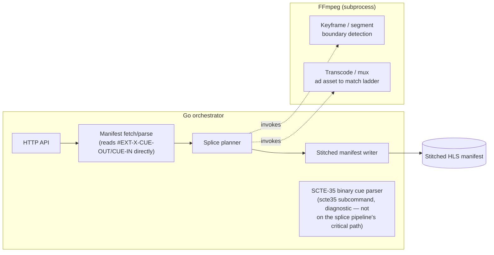
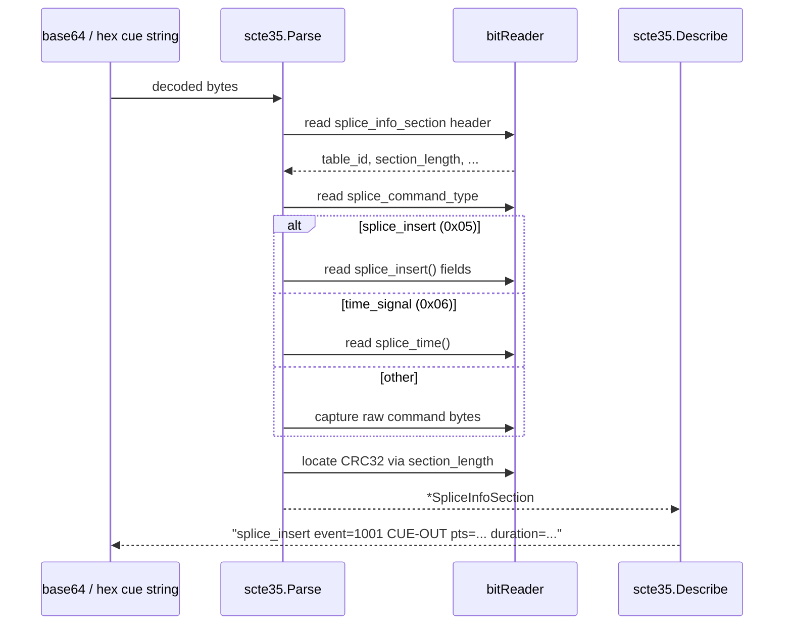
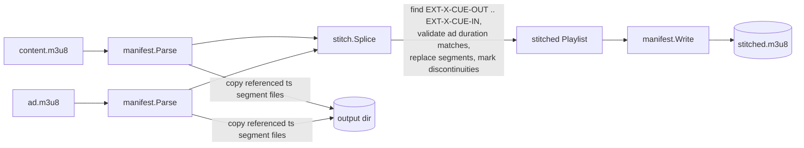
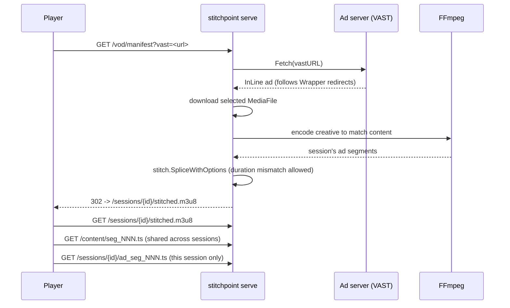
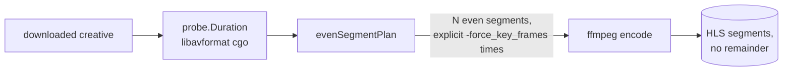
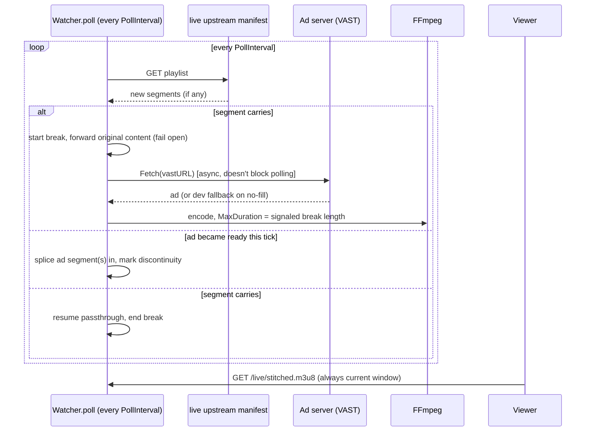

# stitchpoint

[](https://github.com/izaacledererjunior/stitchpoint/actions/workflows/ci.yml)
[](https://pkg.go.dev/github.com/izaacledererjunior/stitchpoint)
[](LICENSE)

A reference-implementation Server-Side Ad Insertion (SSAI) stitcher for VOD
HLS streams. Built as a portfolio project to demonstrate hands-on
understanding of SCTE-35 ad signaling and HLS manifest/segment stitching —
the layer of ad tech below the client-side player/GAM/IMA SDK integration
work, and the part that's genuinely hard to fake or learn from docs alone.

> **Status: active development / beta.** Phases 1–4 (SCTE-35 parsing, VOD
> stitching, the cgo/libavformat boundary-detection path, and live SSAI) are
> all implemented and covered by unit/integration tests — see each phase's
> section below for what that actually means. This is still a portfolio
> reference implementation, not a finished or production-hardened product:
> APIs, CLI flags, and test assets can change without notice, and the one
> concretely open item is the visual proof-of-splice recording (see "Proof
> artifact" below), which hasn't been captured yet.

## The problem

Server-side ad insertion splices ad content directly into a stream's
manifest and segments, server-side, so the client player never has to know
an ad break happened — no client-side VAST parsing, no ad-blocker-visible
seams. To do that correctly, a stitcher has to:

1. **Detect ad breaks.** Streams signal upcoming avails with SCTE-35 cue
   messages — a compact binary format carrying event IDs, PTS timing, and
   break duration, delivered either in-band (MPEG-TS) or as base64 in HLS
   manifest tags (`#EXT-X-DATERANGE`, `#EXT-OATCLS-SCTE35`).
2. **Splice cleanly.** The replacement ad segments have to land on exact
   segment/keyframe boundaries and match the main content's codec/bitrate
   ladder, or playback glitches (visible frame tears, audio pops, ABR
   ladder mismatches) at the splice point.

## Why it's hard

- **SCTE-35 is a bit-packed binary format**, not JSON — fields span
  non-byte-aligned widths (a 33-bit PTS value packed next to a handful of
  1-bit flags), and the spec defines multiple splice command types with
  different, conditionally-present fields. Get the bit offsets wrong and
  you silently misread the next field instead of failing loudly.
- **Timing has to survive the PTS → wall-clock → segment-boundary chain**
  without drifting. SCTE-35 times are 90kHz PTS ticks; HLS segments are
  fixed-duration wall-clock chunks. Splicing "close enough" produces a
  visible glitch, not a subtle bug.
- **Ad and content assets rarely agree by default.** Matching bitrate,
  codec, and segment duration between the ad asset and the main content
  ladder is what makes the splice invisible — mismatches are the most
  common source of a bad splice in real SSAI systems.

## Architecture



**Go** handles orchestration: the HTTP API, manifest fetching/parsing,
session state, and concurrency across requests. **FFmpeg**, invoked as a CLI
subprocess (not cgo bindings, for v1), handles the media-critical path —
keyframe/segment boundary detection and any transcoding/muxing needed to
match the ad asset to the content ladder.

This split matches how real production SSAI systems are usually built
(orchestration language + FFmpeg/transcode farm for the media path), and
deliberately builds Go fluency rather than sinking early time into
reimplementing HTTP/manifest parsing in C. See
[docs/adr/0001-ffmpeg-cli-vs-cgo.md](docs/adr/0001-ffmpeg-cli-vs-cgo.md) for
the full reasoning and what would change this decision later.

### SCTE-35 cue parsing flow (Phase 1, current)



`internal/hls` sits in front of this for the `-manifest` path: it scans
playlist text for the tags real packagers use to carry SCTE-35
(`#EXT-OATCLS-SCTE35`, `#EXT-X-CUE-OUT-CONT`, `#EXT-X-DATERANGE`,
`#EXT-X-SCTE35`), and hands each cue's still-encoded value to
`scte35.Parse`. It deliberately doesn't model the rest of the playlist
(segments, durations) — that's Phase 2's job, once splicing needs a
segment-boundary-aware structure to act on, not just a place to find cues.

### VOD splice flow (Phase 2)



The splice is manifest-level, not a re-encode: HLS VOD playback is a
segment list, so as long as the ad's segments cover exactly the break
duration signaled by `#EXT-X-CUE-OUT`/`#EXT-X-CUE-IN`, replacing the
segment references is enough — no frame-level splicing needed. That's why
the checked-in test assets are pre-encoded to match codec, resolution,
bitrate, and segment duration (see "Test assets" below); `stitch.Splice`
refuses to splice (returns `DurationMismatchError`) rather than silently
producing a broken manifest if they don't line up.
`#EXT-X-DISCONTINUITY` is inserted at both transition points, since even
matched encodes come from independent FFmpeg sessions with unrelated
internal timestamps — that tag is what tells a real player to reset its
timeline there instead of expecting continuity.

### Dynamic SSAI server (beyond the original Phase 2 plan)

`stitch` (above) is a *batch* tool: run once, produces one static
manifest. Real SSAI systems make a fresh ad decision per playback
session — the same content, but a different ad each time someone starts
watching. `stitchpoint serve` (`internal/server`) does that: every
`GET /vod/manifest` runs the full VAST → download → transcode → splice
pipeline live and redirects to a session-scoped manifest.



Deliberate scope decisions (see `internal/server`'s package doc for the
full reasoning):

- **One content asset per server instance**, configured at startup
  (`-content`); only the VAST tag varies per request. A real deployment
  would run one of these per title/channel.
- **Content segments are served once**, from a shared `/content/` path,
  and reused across every session — only the ad's segments are unique per
  session. Copying the (large, shared) content into every session
  directory would be wasteful and isn't how real SSAI systems do it.
- **No fallback to content-only playback on a VAST no-fill.** A
  production system would very likely serve plain content back rather
  than fail the session; this returns `204 No Content` instead, so a
  no-fill is visible while testing/demoing rather than silently masked.
  See "Future ideas".
- Session cleanup is a coarse time-based sweep (`SessionTTL`, default
  30 minutes), not anything more sophisticated.

**A real bug this caught**: the FFmpeg-based encoder names ad segments
generically (`seg_000.ts`, `seg_001.ts`, ...) — which happens to be
exactly this project's own content-segment naming convention too. Without
correcting for that, an ad segment could get misclassified as a content
segment (matched by URI string) and served from the wrong, shared path.
Caught via a real end-to-end manual server run before it was ever written
up as "working," not from the unit tests alone — fixed by renaming every
ad segment file (`ad_` prefix) right after encoding, and now covered by a
regression test (`TestServer_DynamicSession_EndToEnd`'s collision checks
in `internal/server/server_test.go`).

### Local VAST fixture server (`cmd/vastfixture`)

Real ad servers commonly no-fill for reasons that have nothing to do with
whether the integration works — wrong geo, no active campaign, request
came from an unexpected network (exactly what happened testing against a
real Google Ad Manager tag from a network outside the campaign's targeted
geo; see "Proof artifact" below). Waiting on that to align isn't a
reasonable way to develop or demo the dynamic path, and an earlier
approach here — a locally-saved *captured* real VAST response used as a
dev-only fallback — traded that problem for another: a captured
response's `MediaFile` is a signed, time-limited CDN URL, and it *did*
expire once during real Phase 4 testing (see "Validated against a real
live channel" below).

`cmd/vastfixture` (`internal/adfixture`) removes the real ad network from
the picture entirely instead: it's a small, separate Go binary that
always fills, always serves the same real, checked-in creative
(`testdata/vastfixture/creative.mp4`) from a URL that never expires, and
returns a spec-conformant VAST 4.2 InLine response — `MediaFiles`,
`TrackingEvents`, and an `AdVerifications`/OMID block, since real
responses commonly carry one and a client needs to tolerate it.

```sh
go build -o bin/vastfixture ./cmd/vastfixture
./bin/vastfixture -addr :9090
# vastfixture: listening on :9090 (creative=testdata/vastfixture/creative.mp4)

# In another shell — stitch/serve/live all just take a VAST URL:
./bin/stitchpoint stitch \
  -content testdata/vod/content/content.m3u8 \
  -vast "http://localhost:9090/vast" \
  -out /tmp/stitched-fixture-out
```

That's a real, fully local, fully working demo with zero ad-network
dependency and zero risk of an expiring URL — verified end-to-end against
both `stitch` and `serve` (the fixture's own response is fed through
`internal/vast.Fetch`, the actual project client, in `internal/adfixture`'s
own tests, not just asserted well-formed in isolation).

`internal/adfixture` is deliberately kept separate from, and isn't
imported by, any of the core SSAI packages — see
[docs/adr/0004-self-hosted-vast-fixture-server.md](docs/adr/0004-self-hosted-vast-fixture-server.md)
for the full reasoning, including exactly where a real ad-decisioning
call (an SSP/exchange endpoint, a Prebid Server auction, Google Ad
Manager) would replace this fixture in production — that point is named
directly in the VAST response's own `<Extensions>` block, not just in a
code comment.

### Keyframe/segment boundary detection via cgo (Phase 3)

`internal/probe` binds directly to `libavformat`/`libavcodec` via cgo —
see [docs/adr/0002-cgo-libavformat-for-boundary-detection.md](docs/adr/0002-cgo-libavformat-for-boundary-detection.md)
for the full decision record, including the real cost (dev headers now
required to build at all). This exists because of a real bug, not
optimization for its own sake: `EncodeHLS` used to ask FFmpeg's HLS muxer
to cut segments at a fixed interval, and a creative whose duration didn't
divide evenly by that interval left a spurious sub-second trailing
segment. `probe.Duration()` reads the creative's exact duration directly
from libavformat before encoding starts, so `evenSegmentPlan` can compute
genuinely even segment boundaries instead of trusting FFmpeg to land on a
clean one.



`probe.Keyframes()` — walking real `AV_PKT_FLAG_KEY` packet positions,
not just container-level duration — is the more literal "keyframe
detection" capability named in ADR 0001 as the eventual Phase 3 target;
it's exposed standalone via `stitchpoint probe <file>` (see "How to run
it") as a diagnostic tool, though `EncodeHLS` itself only needs
`Duration()` to fix the bug above.

### ABR ladder benchmarking (Phase 3 side artifact)

`internal/abrbench` (`stitchpoint abr-bench`) encodes an input at each
rung of a standard 4-rung ABR ladder (240p/360p/480p/720p) and reports how
closely FFmpeg's actual output bitrate tracked each rung's target —
`probe.Duration()` again, instead of another `ffprobe` shell-out, tying
this back into the same Phase 3 cgo work. This is the optional ABR
ladder / bitrate-matching benchmarking side tool called out as a Phase 3
stretch goal in the project plan. Deliberately bitrate/size/time only, no
perceptual quality metric — see the tool's package doc for why.

## Live SSAI (Phase 4)

`internal/live` (`stitchpoint live`) does what `serve` does, but for a
live channel instead of a static VOD asset — real dynamic SSAI the way
Google's own server-side ad insertion works: watch a live manifest, catch
a cue point as it happens, request a VAST tag (or use the dev fallback on
a no-fill), and stitch the resulting ad in while the stream keeps playing.

This is genuinely different architecture from `serve`, not an extension
of it — see `internal/live`'s package doc and
[docs/adr/0003-live-ssai-fail-open-and-exact-duration.md](docs/adr/0003-live-ssai-fail-open-and-exact-duration.md)
for the full reasoning. The short version:



Three decisions worth calling out (all in ADR 0003, with what was
rejected and why):

- **Fail open.** Ad resolution (VAST fetch + download + transcode) takes
  real seconds — it can't be ready the instant a break starts. Rather
  than stall every viewer's playback waiting, the original break content
  plays until the ad is ready, then the ad gets spliced in mid-break.
  A break can legitimately play with no ad at all if resolution is slow
  or fails — that's the design working as intended, not a bug.
- **Exact-duration matching, not grow-to-fit.** VOD's
  `stitch.Options.AllowDurationMismatch` doesn't apply here — a live
  timeline is real and already playing, so `transcode.Params.MaxDuration`
  trims an over-length creative to the exact signaled break
  (`#EXT-X-CUE-OUT:<duration>`, captured in
  `manifest.Segment.CueOutDuration` — a field VOD splicing never needed,
  since VOD infers the break length from real segments that already
  exist). An under-length creative is covered by `live.BreakFiller`
  (`internal/live/fill.go`) — a small interface, not logic baked into
  `resolveAd`, specifically because today's implementation
  (`LoopFiller`, repeating the one resolved creative until the target is
  covered) is a placeholder for real ad-pod filling (resolving multiple
  VAST responses, or a VAST pod XML's sequenced `<Ad>` entries, and
  stitching distinct creatives together) — see ADR 0006. Real production
  DAI fills a break with actual different ads, not a loop; this keeps the
  reference pipeline duration-correct in the meantime without pretending
  the loop is the finished feature.
- **One shared window per channel, not per-viewer personalization.** Real
  DAI systems can show different viewers different ads for the same
  break; this serves one stitched result to everyone watching a given
  channel. Per-viewer live personalization is a materially larger design
  (session-scoped live windows, not one shared poller) — a real
  simplification versus production SSAI, not an oversight.

### Validated against a real live channel

Everything above was also run against a real, uncontrolled live broadcast
(an SCTE-35-bearing channel, joined at its `_360p` rendition) — not just
the simulated upstream in `internal/live/live_test.go`. A real
`splice_insert` CUE-OUT cue decoded correctly, real passthrough held up
across many polls, and break detection correctly kicked off ad
resolution the moment the cue appeared. The first real breaks failed to
splice anything — tracked down using per-stage lifecycle logging added to
`resolveAd`/`processSegment`/`endBreak` specifically to make this
traceable — to an expired signed URL on the dev fallback creative
(captured hours earlier); the fail-open design handled that exactly as
intended (no crash, uninterrupted passthrough, one clear log line). Once
a fresh VAST tag and fallback capture were supplied, the very next real
break filled live (no fallback needed), downloaded and transcoded a real
creative, correctly logged an underfill (15s of ad against a signaled
2-minute break), and spliced it in with a discontinuity marker — verified
by fetching the actual served ad segment over HTTP (200, a real playable
`.ts`, `ffprobe`-confirmed duration), not just a manifest line.

## How to run it

Requires Go 1.26+ (see `go.mod`), `ffmpeg` on `PATH` (Phase 2), and, as of Phase 3,
`libavformat`/`libavcodec`/`libavutil` **development headers** plus a C
compiler (`libavformat-dev libavcodec-dev libavutil-dev` on
Debian/Ubuntu) — `internal/probe` binds directly to libavformat via cgo;
see [docs/adr/0002-cgo-libavformat-for-boundary-detection.md](docs/adr/0002-cgo-libavformat-for-boundary-detection.md)
for why, and the real cost of that (the project is no longer buildable
with just the `ffmpeg` binary on `PATH` — dev headers are now required
too).

```sh
git clone https://github.com/izaacledererjunior/stitchpoint.git
cd stitchpoint
go build -o bin/stitchpoint ./cmd/stitchpoint
# or: go install github.com/izaacledererjunior/stitchpoint/cmd/stitchpoint@latest

# Decode one or more SCTE-35 cues (base64 or hex) and print ad break info
./bin/stitchpoint scte35 "/DAvAAAAAAAA///wFAVIAACPf+/+c2nALv4AUsz1AAAAAAAKAAhDVUVJAAABNWLbowo="
# splice_insert event=1207959695 CUE-OUT pts=5h58m34.559088888s duration=1m0.293566666s

# Or from a file / stdin, one cue per line
./bin/stitchpoint scte35 -file cues.txt
cat cues.txt | ./bin/stitchpoint scte35

# Or pull every cue straight out of an HLS playlist (#EXT-OATCLS-SCTE35,
# #EXT-X-CUE-OUT-CONT, #EXT-X-DATERANGE, #EXT-X-SCTE35 are all recognized)
./bin/stitchpoint scte35 -manifest playlist.m3u8

# Against the checked-in self-authored test stream (see "Test assets"):
./bin/stitchpoint scte35 -manifest testdata/vod/content/content.m3u8
# line 12 (EXT-OATCLS-SCTE35): splice_insert event=100 CUE-OUT pts=30s duration=10s
# line 16 (EXT-OATCLS-SCTE35): splice_insert event=101 CUE-IN pts=40s

# Or the same thing for a DASH MPD's EventStream cues (see
# internal/mpd and internal/dashsplice — playground Milestone 3):
./bin/stitchpoint scte35 -mpd testdata/dash/content.mpd
# period=46041 event= presentationTime=0s: splice_insert event=99 CUE-OUT pts=24h11m4.166666666s duration=1m45s

# Or the SCTE-35 cues carried inband via emsg boxes in a DASH media
# segment itself (see internal/mpd/emsg.go — Milestone 3's other half):
./bin/stitchpoint scte35 -segment testdata/dash/content/chunk-stream0-00001-with-emsg.m4s
# emsg id=100 v1 presentationTime=20s duration=10s: splice_insert event=1207959695 CUE-OUT pts=5h58m34.559088888s duration=1m0.293566666s

# Splice the ad into the content at its signaled break, producing a
# self-contained, playable output directory:
./bin/stitchpoint stitch \
  -content testdata/vod/content/content.m3u8 \
  -ad testdata/vod/ad/ad.m3u8 \
  -out /tmp/stitched-out
# stitched manifest: /tmp/stitched-out/stitched.m3u8
# 6 segments total (1 ad segment(s) spliced in)

# Play it (VLC, or any local static file server + hls.js/Safari) to see
# the splice — open /tmp/stitched-out/stitched.m3u8 directly in VLC, or:
python3 -m http.server --directory /tmp/stitched-out 8000
# then load http://localhost:8000/stitched.m3u8 in a browser HLS player

# Or drive the ad from a real ad-decision request instead of a local file —
# any VAST 2/3/4 tag URL works, including a Google Ad Manager ad tag:
./bin/stitchpoint stitch \
  -content testdata/vod/content/content.m3u8 \
  -vast "https://.../gampad/ads?..." \
  -out /tmp/stitched-vast-out
# VAST: "..." via Google Ad Manager, video/mp4 creative, 15s duration
# stitched manifest: /tmp/stitched-vast-out/stitched.m3u8
```

`-vast` fetches the tag, follows any `Wrapper` redirect chain, downloads
the selected creative, and encodes it via FFmpeg to match the content —
see `internal/vast` and `internal/transcode`. Unlike `-ad`, it doesn't
require the ad's duration to match the break exactly (`stitch.Options`'s
`AllowDurationMismatch`): a real ad-decision response can't guarantee
that, and per this project's VOD architecture, the manifest is allowed to
grow or shrink to fit rather than forcing an exact match.

```sh
# Run as a live dynamic-SSAI server instead of a one-shot batch command —
# every request gets its own fresh ad decision (see "Dynamic SSAI server" above):
./bin/stitchpoint serve -addr :8080 -content testdata/vod/content/content.m3u8
# stitchpoint serve: listening on :8080 (content=testdata/vod/content/content.m3u8)

# In another shell — each call is an independent session with its own ad:
curl -i "http://localhost:8080/vod/manifest?vast=<vast-tag-url>"
# HTTP/1.1 302 Found
# Location: /sessions/<id>/stitched.m3u8
curl "http://localhost:8080/sessions/<id>/stitched.m3u8"

# Fully local — no real ad network at all — using the fixture server
# from another shell (see "Local VAST fixture server" above):
./bin/vastfixture -addr :9090 &
./bin/stitchpoint serve -addr :8080 \
  -content testdata/vod/content/content.m3u8 \
  -vast "http://localhost:9090/vast"

# Inspect any media file's duration and real keyframe positions directly
# via libavformat (cgo) — see "Keyframe/segment boundary detection" above:
./bin/stitchpoint probe testdata/vod/ad/seg_000.ts
# duration: 10.031011s
# keyframes: 1
#   [0] 1.466666666s

# Benchmark a standard ABR ladder against a real input (-out must come
# before the input path — a Go flag-parsing constraint):
./bin/stitchpoint abr-bench -out /tmp/abr-bench-out testdata/vod/ad/seg_000.ts
# RUNG     RESOLUTION      TARGET     ACTUAL    DELTA     ENCODE
# 240p     426x240          464k      487k   +4.9%      493ms
# 360p     640x360          896k      939k   +4.8%      477ms
# 480p     854x480         1528k     1560k   +2.1%      897ms
# 720p     1280x720        2928k     2947k   +0.6%     1.397s

# Watch a live channel, splicing ads in as breaks appear — see "Live SSAI" above
# (any VAST URL works here too, including a fully local ./bin/vastfixture instance):
./bin/stitchpoint live -addr :8080 \
  -upstream https://example.com/live/channel.m3u8 \
  -vast "https://pubads.g.doubleclick.net/gampad/ads?..."
# stitchpoint live: listening on :8080 (upstream=https://example.com/live/channel.m3u8)
# watch it: curl http://localhost:8080/live/stitched.m3u8
```

### DASH

`dash-stitch` is `stitch`'s DASH equivalent — same `-ad`/`-vast` shape,
same idea, genuinely different mechanism underneath: DASH splices by
splitting the content's `Period` at the SCTE-35 break and inserting a new
`Period` for the ad, not by rewriting a segment list (see
`internal/dashsplice`'s package doc and ADR 0007 for why, and its scope:
`SegmentTimeline`-based content, break timing from `Event/@presentationTime`,
one cue spliced per call).

```sh
./bin/stitchpoint dash-stitch \
  -content testdata/dash/content/content.mpd \
  -ad testdata/dash/ad/ad.mpd \
  -out /tmp/dash-stitched-out
# spliced MPD: /tmp/dash-stitched-out/stitched.mpd
# 3 periods total (1 ad period inserted)

# Decodes clean start to finish, same verification stitch's own output gets:
ffmpeg -v error -i /tmp/dash-stitched-out/stitched.mpd -f null -
```

Run the test suite (table-driven, includes malformed/truncated input and
the ad-duration-mismatch case):

```sh
go test ./... -race
```

## Test assets

**SCTE-35 cue vectors (Phase 1):** unit tests use hand-built binary
vectors constructed bit-for-bit against the ANSI/SCTE 35 syntax tables
(see `internal/scte35/scte35_test.go`), rather than checked-in opaque blobs,
so the expected struct fields and the bytes that produce them stay
verifiably in sync. As an extra sanity check, a real `time_signal` cue
published in [AWS MediaConvert's SCTE-35 documentation](https://docs.aws.amazon.com/mediaconvert/latest/ug/sample-manifest-scte-35-enhanced-ad-markers.html)
also decodes cleanly with this parser:
`./bin/stitchpoint scte35 "/DAnAAAAAAAAAP/wBQb+AA27oAARAg9DVUVJAAAAAX+HCQA0AAE0xUZn"` → `time_signal pts=10s`.

**Full VOD stream + ad asset (Phase 1/2):** a search of Mux's and Bitmovin's
public demo/test asset libraries did not turn up a stream with real in-band
SCTE-35 markers ready to use as-is, so per the project plan's fallback,
`testdata/vod/` is self-authored — checked in, not fetched, so the project
is reproducible without external dependencies. It's built from three
pieces:

1. **Main content** (`testdata/vod/content/`): a 60s synthetic clip
   (`testsrc` + a 440Hz tone), encoded and segmented into 6×10s HLS VOD
   segments — the same shape a real 60s VOD asset would take.
2. **Ad asset** (`testdata/vod/ad/`): a 10s synthetic clip (`testsrc2` + an
   880Hz tone, audibly/visually distinct from the content for later manual
   playback verification in Phase 2), encoded to the *same* codec,
   resolution, and bitrate as the content — the matching this project's
   "why it's hard" section calls out as what makes a splice invisible.
3. **Real SCTE-35 cues**: a `splice_insert` CUE-OUT (event 100, PTS=30s,
   duration=10s) and CUE-IN (event 101, PTS=40s) were generated with
   `cmd/gentestcue` — a small dev-only tool that hand-packs a genuine,
   spec-conformant `splice_info_section` (not a hardcoded fixture string) —
   and inserted as `#EXT-OATCLS-SCTE35` tags into `content.m3u8` at the
   30s/40s segment boundaries, timed to exactly bracket the 10s ad. Both
   cues were independently verified against Comcast's `threefive` decoder
   before being committed.

To regenerate from scratch:

```sh
# 1. Encode the content and ad clips (see testdata/vod/*/*.m3u8 for the
#    exact ffmpeg invocations used — testsrc/testsrc2 + sine, libx264 +
#    aac, forced 10s keyframe-aligned HLS segments).
# 2. Generate the two cues:
go run ./cmd/gentestcue -event 100 -pts 30 -duration 10 -program-id 1
go run ./cmd/gentestcue -event 101 -pts 40 -cue-in -program-id 1
# 3. Insert each as an #EXT-OATCLS-SCTE35 line immediately before the
#    EXTINF/segment where the break starts/ends in content.m3u8.
```

This is what `internal/hls/integration_test.go`'s
`TestExtractCues_RealTestStream` runs against automatically — Phase 1's
actual done-criteria check ("identifies and prints all ad breaks in a known
test stream with real SCTE-35 markers"), not just a manual CLI run. The
same asset also carries standard `#EXT-X-CUE-OUT`/`#EXT-X-CUE-IN` tags
(alongside the SCTE-35 tags), which is what Phase 2's splicer keys off of —
see `internal/stitch/integration_test.go`'s `TestSplice_RealTestStream` for
the automated equivalent on the splice side.

**Demo content (`testdata/demo-content/`):** the playground's quick-demo
path (`POST /api/demo`, `cmd/playground-api`'s `-demo-content` default)
serves a real ~2m24s clip with **two** ad breaks inserted — 30s target
each, at the 15s and 75s marks — not the short synthetic
`testdata/vod/content` asset above — a stronger portfolio signal for the
one path most reviewers will actually click through. Produced with this
project's own `internal/contentprep.InjectBreaks`, authored specifically
for `stitch.Options.PreserveAllContent` (ADR 0009): **nothing from the
source is ever discarded** — every second of the original clip survives
in the manifest, the two break points just mark where the ad gets
inserted, and the final stitched result grows to ~203.9s (the source's
own ~143.9s, plus both ad insertions) rather than staying the same
length with chunks of the original replaced. `internal/stitch.Splice`
itself splices every break it finds in one manifest (not just the
first), and — since the real ~10s ad is shorter than each break's 30s
target — loops it 3x to actually fill that target
(`stitch.Options.LoopAdToFillBreak`, mirroring
`internal/live.LoopFiller`'s same idea for live SSAI). Verified the same
way as every other test asset here — the content manifest alone decodes
clean end to end, and separately, the actual stitched result (every
`#EXTINF` summed by hand from a live `POST /api/demo` run against the
real running `playground-api`/`vastfixture` containers, confirming the
~203.9s figure, then every segment downloaded and decoded clean) does
too.

**VAST fixture creative (`cmd/vastfixture`, see "Local VAST fixture
server" above):** `testdata/demo-ad/advertising.mp4` (`cmd/vastfixture`'s
`-creative` default) is a real ad clip (960x540 h264+aac, ~10s) provided
for this project's demo, not a synthetic `testsrc`/`sine` clip like the
rest of this project's test assets — deliberate, same reasoning as the
demo content above: it's the one creative the playground's quick-demo
mode and any `-vast http://localhost:9090/vast` CLI run against a
running `vastfixture` actually splices in.
`testdata/vastfixture/creative.mp4` (a synthetic 6s clip, unchanged) is
a separate asset — `internal/contentprep` and `internal/transcode`'s own
generic encode tests use it purely as a small, fast, real-enough source
video, unrelated to the demo. `adfixture.DefaultConfig`
(`internal/adfixture/adfixture.go`) reports the real demo creative's
dimensions/bitrate and a whole-second duration in the VAST `<Duration>`
element specifically
— see that field's doc for why a fractional duration would round-trip
lossily through VAST's `HH:MM:SS`-only format.

**DASH content + ad (`testdata/dash/`, `internal/dashsplice`):** generated
via `transcode.EncodeDASH` from the *same* source content/ad `.m3u8`
assets above (60s content at a 10s segment target -> 6 segments; the 10s
ad -> 1 segment), video-only (no audio track — see ADR 0007's
"independent per-track segmentation" consequence for why: aligning an
independently-segmented audio track to an arbitrary break point needs
production packaging guarantees this project's FFmpeg-CLI-based
`EncodeDASH` doesn't provide, which is a separate concern from what these
fixtures exist to exercise). `content/content.mpd`'s `EventStream` cue
(`presentationTime=20s duration=10s`, bracketing the third of six 10s
segments) was hand-inserted into `EncodeDASH`'s own output — real
`transcode.EncodeDASH`, real `mpd.Write`, only the cue itself
authored — the same "own the parts this project is actually
demonstrating, not the whole pipeline" balance the SCTE-35 cue insertion
above strikes for the HLS assets. Verified the same way: decodes clean
via `ffmpeg -i .../stitched.mpd -f null -`, both from
`TestSplice_RealDASHAssets` and by running the actual `dash-stitch`
binary (see "DASH" above).

**Inband `emsg` segment (`testdata/dash/content/chunk-stream0-00001-with-emsg.m4s`,
`internal/mpd/emsg.go`):** the same real `chunk-stream0-00001.m4s` above,
with one real, hand-packed `emsg` box (version 1, `urn:scte:scte35:
2013:bin`) prepended — `message_data` is the real, previously
externally-validated SCTE-35 cue this README's own top-level usage
example decodes and verifies, not an invented payload. Used by
`TestExtractEmsgCues_RealSegment` and by the `-segment` CLI example
above.

## Live demo

**[stitchpoint.izaac.site](https://stitchpoint.izaac.site)** — an
interactive, publicly hosted version of the pipeline (see
[docs/playground-plan.md](docs/playground-plan.md)): upload a video, mark
an ad break, and watch the real VAST fetch → download → transcode →
splice pipeline run and produce a playable result in the browser. Backed
by the `playground-api` service in this repo
(`internal/playground`/`cmd/playground-api`) and the
[`stitchpoint-playground`](https://github.com/izaacledererjunior/stitchpoint-playground-)
frontend.

## Proof artifact

**Not yet captured — the one concretely open item in this project.** In
the meantime, the "Live demo" above is a stronger, always-available
substitute: it's the actual pipeline running end to end, not a recording
of it. `stitch.Splice` has been verified structurally (unit + integration
tests)
and the stitched output decodes cleanly end-to-end under FFmpeg
(`ffmpeg -v error -i stitched.m3u8 -f null -` exits 0 with the correct 60s
total duration) — but neither check confirms a *visually* clean splice (no
frame tear, no A/V desync at the boundary), which needs eyes on a real
player, not a decoder exit code. The `stitch`/`serve` commands under "How to
run it" already produce a playable output directory today; what's missing
is recording that playback and embedding it here as
`docs/media/proof-artifact.gif`.

`-vast` has additionally been run against a real Google Ad Manager tag
(my own GAM account). The result was a valid no-fill
(`<VAST version="4.0"/>`, no `<Ad>`) — almost certainly because the
request came from a network outside the campaign's targeted geo, not a
bug — and the pipeline handled it correctly: a clear
`vast.ErrNoFill`-wrapped message and a clean exit, no crash. That's a real
data point on error-handling robustness; it doesn't yet demonstrate a
successful real fill through the full transcode+splice pipeline, which
still needs a request from a network the campaign actually targets.

Separately, `stitch` (with `-ad`, a synthetic clip — not `-vast`) has been
run against a **real third-party VOD asset** (a JW Player demo stream,
real segments downloaded and spliced with genuine `#EXT-X-CUE-OUT`/
`#EXT-X-CUE-IN` tags added at a real segment boundary), not just the
checked-in synthetic test content — confirming the splice engine holds up
against a real-world encode, not just assets this project generated
itself. FFmpeg decoded the result cleanly end to end.

## What was learned

- Independently-encoded segments joined at a discontinuity carry unrelated
  internal timestamps even when codec/bitrate/resolution match exactly —
  `#EXT-X-DISCONTINUITY` exists specifically so a player resets its
  timeline there instead of expecting continuity. Confirmed while
  decode-checking the stitched test stream — see
  `internal/stitch/stitch.go` and the "VOD splice flow" diagram above.
- A generic segment-naming scheme (FFmpeg's HLS muxer defaults to
  `seg_000.ts`, `seg_001.ts`, ...) isn't just a cosmetic choice — it's a
  real collision surface once ad and content segments end up addressable
  by the same identifier space. `internal/server` classifies segments as
  content-origin or ad-origin by URI, and the transcoder's generic naming
  collided with this project's own content-segment naming convention,
  silently misrouting an ad segment to the wrong (shared, non-session)
  path. Only caught by actually running the live server end to end and
  reading the resulting manifest by eye — the unit tests alone, built
  against the same mental model as the bug, didn't catch it. Fixed by
  renaming ad segments to an unambiguous prefix right after encoding; see
  "Dynamic SSAI server" above.
- A media file's video PTS doesn't necessarily start at 0 — a checked-in
  test MPEG-TS segment's first frame genuinely starts at 1.466667s (a
  PCR/muxing-offset property, confirmed independently via `ffprobe
  -show_entries stream=start_time` reporting the identical value — not a
  bug). Caught because `internal/probe`'s tests ran against a real file
  instead of a synthetic one with a convenient zero start; the test's
  original "first keyframe near 0" assumption was the actual bug, not the
  cgo binding. See `internal/probe/probe_test.go`.
- Async work racing against fast-moving state needs the test (and the
  system) to actually account for the race, not just hope timing works
  out. The first version of `internal/live`'s integration test advanced
  its simulated live upstream straight through to `#EXT-X-CUE-IN` on a
  fixed schedule, and the real ad-resolution goroutine (real VAST fetch +
  real FFmpeg encode) sometimes hadn't finished by the time the simulated
  break ended — so the break correctly closed with no ad, and the test
  failed because it expected one. The fix wasn't a longer fixed delay
  (still racy, just less often) — it was making the simulated upstream
  keep advancing with filler segments until the real ad was *confirmed*
  spliced before ever introducing `CUE-IN`. That same race — a real ad
  not being ready before a break ends — is also just correct, intended
  live behavior (see "Live SSAI" above, ADR 0003's fail-open decision);
  the test bug was assuming the race would always resolve one particular
  way, not the underlying design.

## Future ideas

Deliberately deferred, not forgotten:

- **Live: pre-fetch ads ahead of the avail.** `internal/live` starts ad
  resolution only when `#EXT-X-CUE-OUT` actually appears, so the fail-open
  path (original content while the ad resolves) is the common case, not
  an edge case. Real SCTE-35 in production commonly signals a break
  several seconds before it starts specifically so the ad-decision step
  has runway — using that lead time is the natural fix, deferred here
  since it requires the manifest carrying (or a side channel providing)
  cue signals ahead of the actual break, which this project's own live
  test setup doesn't currently model.
- **Live: real ad-pod filling, replacing `LoopFiller`.** `live.BreakFiller`
  (ADR 0006) is the seam this is meant to land in: a filler that resolves
  multiple VAST responses (or a VAST pod XML's sequenced `<Ad>` entries)
  and stitches distinct creatives together to cover a break's signaled
  duration, instead of `LoopFiller`'s placeholder of repeating one
  creative. Should be a new `BreakFiller` implementation wired into
  `live.Config`, not a change to `resolveAd`/`spliceAd`/the output-window
  logic.
- **Live: per-viewer ad personalization.** `internal/live` serves one
  shared stitched window per channel; real DAI systems can show different
  ads to different viewers for the same break. Would need session-scoped
  live windows (one poller + N personalized outputs) instead of the
  current one-poller-one-output design — see ADR 0003.
- **Fallback to content-only playback on a VAST no-fill.** `internal/server`
  currently returns `204 No Content` when the ad server has nothing to
  serve. A production system would more likely fall back to playing the
  plain content (no ad, no error) — deferred so the no-fill case stays
  visible while testing/demoing rather than being silently absorbed.
- **Dynamic encode-parameter probing.** `internal/transcode`'s
  `DefaultParams` are fixed constants mirroring `testdata/vod/content`'s
  known encode, not probed via `ffprobe` from whatever `-content` actually
  is. Fine for this project's own test content; would need to be probed
  (or passed explicitly) to match an arbitrary real content asset.
- ~~Sub-second trailing segment from creative re-encoding~~ — **fixed in
  Phase 3**: `internal/probe.Duration()` (cgo + libavformat) now computes
  even segment boundaries before encoding instead of trusting a fixed
  interval; see "Keyframe/segment boundary detection via cgo" above and
  ADR 0002.
- **Snap forced split points to real source keyframes.** `probe.Keyframes()`
  exists and is exposed via `stitchpoint probe`, but `EncodeHLS` only uses
  `Duration()` — the evenly-computed split points aren't currently checked
  against the source's actual keyframe positions. Not needed to fix the
  observed bug (the encoder places fresh keyframes at whatever timestamps
  `-force_key_frames` requests, regardless of the source's own GOP
  structure), but could reduce re-encode artifacting right at a forced
  split if a real source keyframe happens to sit nearby.
- ~~Optional ABR ladder / bitrate-matching benchmarking tool~~ — **built**:
  `stitchpoint abr-bench` (`internal/abrbench`). Deliberately scoped to
  bitrate/size/time only, no perceptual quality metric (VMAF/PSNR/SSIM) —
  this build's FFmpeg isn't compiled with `libvmaf`, and adding a quality
  metric is a meaningfully bigger feature than "does the encoder hit its
  target bitrate." A genuine follow-up, not bundled in for its own sake.
- ~~Phase 4: live SSAI~~ — **built**: see "Live SSAI (Phase 4)" above,
  including real-channel validation. The remaining live-specific gaps
  (pre-fetch, real ad-pod filling, per-viewer personalization) are their
  own items above, not this one.
- Decode `segmentation_descriptor` (currently `time_signal` cues carry PTS
  only; the descriptor is what tells you *why* — ad break start, provider
  placement opportunity, etc.).
- MPEG-TS PID demuxing to pull SCTE-35 sections directly out of a `.ts`
  file rather than requiring pre-extracted cue strings.
- Trim/pad strategy for a near-but-not-exact ad/break duration mismatch
  (`stitch.Splice` currently refuses rather than guessing — see
  `DurationMismatchError`); worth revisiting once there's a real ad source
  whose durations aren't hand-picked to match exactly.

## Non-goals

This is a portfolio reference implementation, not a production-revenue-ready
system. Explicitly out of scope: client-side ad rendering/player
integration (VAST-in-player, IMA SDK), MRC/viewability accreditation, real
ad-exchange integration, and building a real ad-decisioning platform (an
auction, targeting, or SSP/exchange engine) from scratch. `cmd/vastfixture`
doesn't cross this line — it's a deterministic test fixture that always
returns the same static response, the same narrow role Eyevinn's
open-source test ad server fills; see
[docs/adr/0004-self-hosted-vast-fixture-server.md](docs/adr/0004-self-hosted-vast-fixture-server.md)
for that distinction. For a concrete breakdown of everything that stands
between this state and a commercially viable system — ad decisioning
depth, ops/observability, security hardening, encoding precision — see
[docs/commercialization-gap.md](docs/commercialization-gap.md).

## License

[MIT](LICENSE) — see the LICENSE file. Contributions, forks, and use as a
reference for your own SSAI work are all welcome; this project makes no
claim to be production-ready (see "Non-goals" above).
