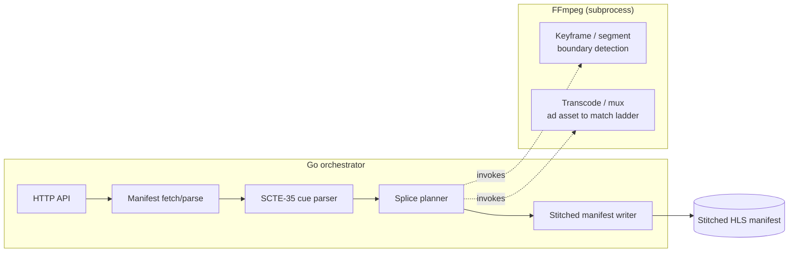
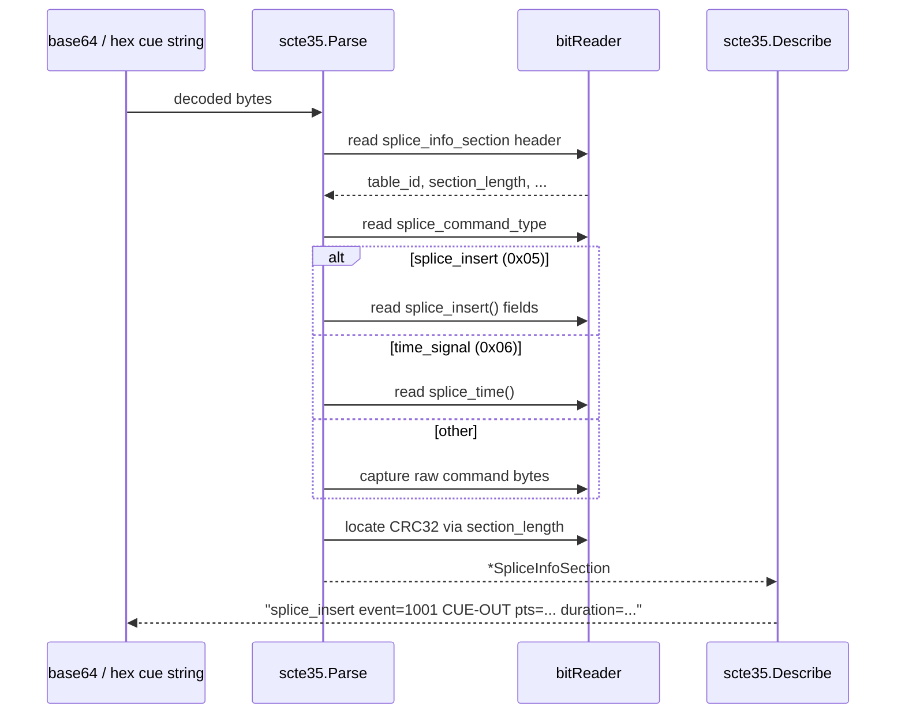
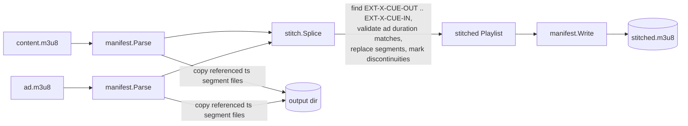
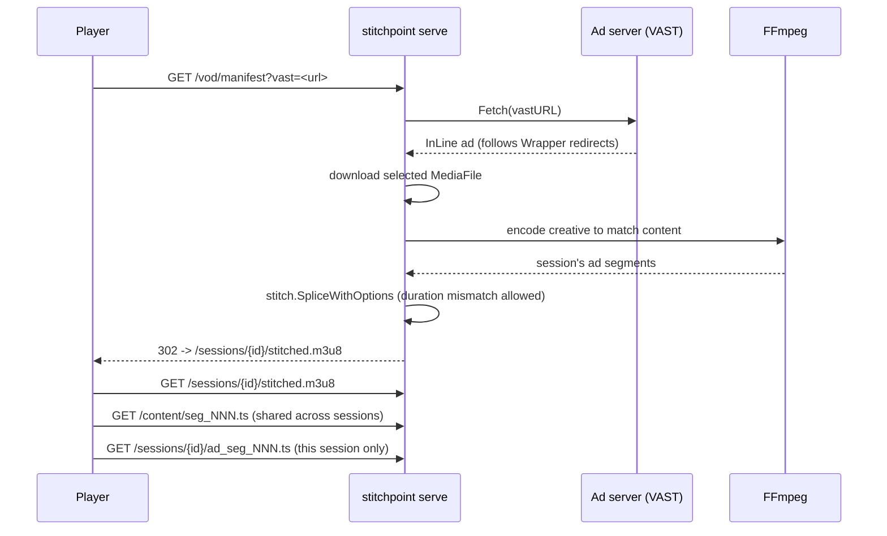
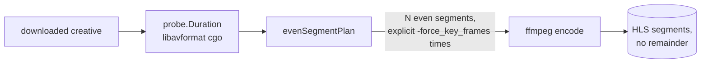
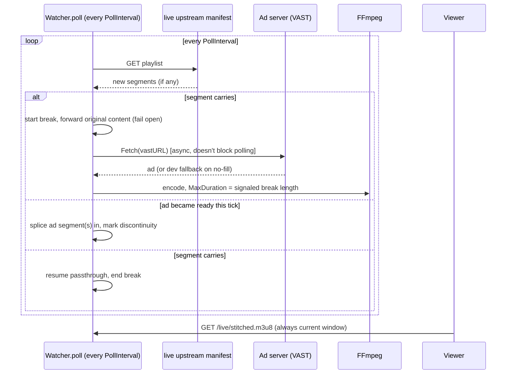

# stitchpoint

[](https://github.com/izaacledererjunior/stitchpoint/actions/workflows/ci.yml)
[](https://pkg.go.dev/github.com/izaacledererjunior/stitchpoint)
[](LICENSE)

🌐 **Idioma:** Português (este arquivo) · [English](README.md)

Uma implementação de referência de um stitcher de Server-Side Ad Insertion
(SSAI) para streams HLS VOD e ao vivo. Construído como projeto de portfólio
para demonstrar conhecimento prático de sinalização de anúncios via SCTE-35
e stitching de manifesto/segmentos HLS — a camada de ad tech abaixo da
integração client-side (player/GAM/IMA SDK), e a parte genuinamente difícil
de simular ou aprender só na documentação.

> **Status:** A Fase 1 (parser SCTE-35) está concluída. A Fase 2 (stitcher
> SSAI para VOD) está funcionalmente completa, incluindo um servidor HTTP
> de inserção dinâmica de anúncios — o único item em aberto é a gravação de
> tela comprovando o splice visualmente (veja "Artefato de prova" abaixo).
> Veja [progress.md](progress.md) (em inglês) para o status exato e o que
> falta.

## O problema

Server-side ad insertion emenda o conteúdo do anúncio diretamente no
manifesto e nos segmentos do stream, do lado do servidor, para que o player
do cliente nunca precise saber que um intervalo comercial aconteceu — sem
parsing de VAST no lado do cliente, sem costuras visíveis para ad blockers.
Para fazer isso corretamente, um stitcher precisa:

1. **Detectar os intervalos de anúncio.** Streams sinalizam avails
   (janelas de inserção) com mensagens de cue SCTE-35 — um formato binário
   compacto que carrega IDs de evento, timing em PTS e duração do
   intervalo, entregue tanto in-band (MPEG-TS) quanto em base64 dentro de
   tags de manifesto HLS (`#EXT-X-DATERANGE`, `#EXT-OATCLS-SCTE35`).
2. **Fazer o splice de forma limpa.** Os segmentos de anúncio que
   substituem o conteúdo precisam cair exatamente nas fronteiras de
   segmento/keyframe e casar com o codec/bitrate ladder do conteúdo
   principal, ou aparecem glitches de playback (frame tear visível,
   estalos de áudio, incompatibilidades no ladder de ABR) no ponto do
   splice.

## Por que é difícil

- **SCTE-35 é um formato binário bit-packed**, não JSON — os campos têm
  larguras não alinhadas a byte (um valor de PTS de 33 bits empacotado ao
  lado de um punhado de flags de 1 bit), e a especificação define vários
  tipos de comando de splice com campos diferentes, presentes
  condicionalmente. Errar os offsets de bit faz você ler o próximo campo
  errado silenciosamente, em vez de falhar de forma visível.
- **O timing precisa sobreviver à cadeia PTS → relógio de parede →
  fronteira de segmento** sem drift. Os tempos do SCTE-35 são ticks de PTS
  a 90kHz; os segmentos HLS são blocos de duração fixa em tempo real.
  Fazer o splice "aproximadamente certo" produz um glitch visível, não um
  bug sutil.
- **Os assets de anúncio e de conteúdo raramente combinam por padrão.**
  Fazer bitrate, codec e duração de segmento do asset de anúncio
  combinarem com o ladder do conteúdo principal é o que torna o splice
  invisível — incompatibilidades são a causa mais comum de um splice ruim
  em sistemas SSAI reais.

## Arquitetura



**Go** cuida da orquestração: a API HTTP, fetch/parse de manifesto, estado
de sessão e concorrência entre requisições. **FFmpeg**, invocado como
subprocesso via CLI (não bindings cgo, para a v1), cuida do caminho crítico
de mídia — detecção de fronteira de segmento/keyframe e qualquer
transcodificação/mux necessária para casar o asset de anúncio com o ladder
do conteúdo.

Essa separação reflete como sistemas SSAI de produção reais costumam ser
construídos (linguagem de orquestração + fazenda de transcode/FFmpeg para o
caminho de mídia), e deliberadamente constrói fluência em Go em vez de
gastar tempo cedo reimplementando parsing de HTTP/manifesto em C. Veja
[docs/adr/0001-ffmpeg-cli-vs-cgo.md](docs/adr/0001-ffmpeg-cli-vs-cgo.md)
(em inglês) para o raciocínio completo e o que mudaria essa decisão mais
adiante.

### Fluxo de parsing de cue SCTE-35 (Fase 1, atual)



`internal/hls` fica na frente disso para o caminho `-manifest`: ele
escaneia o texto do playlist em busca das tags que os empacotadores reais
usam para carregar SCTE-35 (`#EXT-OATCLS-SCTE35`, `#EXT-X-CUE-OUT-CONT`,
`#EXT-X-DATERANGE`, `#EXT-X-SCTE35`), e passa o valor ainda codificado de
cada cue para `scte35.Parse`. Deliberadamente não modela o resto do
playlist (segmentos, durações) — isso é trabalho da Fase 2, quando o
splicing precisa de uma estrutura ciente de fronteira de segmento para
agir, não apenas um lugar para encontrar cues.

### Fluxo de splice VOD (Fase 2)



O splice acontece no nível do manifesto, não é uma re-codificação: a
reprodução de VOD em HLS é uma lista de segmentos, então, contanto que os
segmentos do anúncio cubram exatamente a duração do intervalo sinalizada
por `#EXT-X-CUE-OUT`/`#EXT-X-CUE-IN`, substituir as referências de
segmento já é suficiente — não é preciso splicing no nível de frame. É por
isso que os assets de teste versionados no repositório são pré-codificados
para casar codec, resolução, bitrate e duração de segmento (veja "Assets
de teste" abaixo); `stitch.Splice` se recusa a fazer o splice (retorna
`DurationMismatchError`) em vez de silenciosamente produzir um manifesto
quebrado se eles não baterem.
`#EXT-X-DISCONTINUITY` é inserida nos dois pontos de transição, já que
mesmo codificações que casam perfeitamente vêm de sessões independentes do
FFmpeg com timestamps internos não relacionados — essa tag é o que diz a
um player real para resetar sua linha do tempo ali, em vez de esperar
continuidade.

### Servidor de SSAI dinâmico (além do plano original da Fase 2)

`stitch` (acima) é uma ferramenta *batch*: roda uma vez, produz um único
manifesto estático. Sistemas SSAI reais tomam uma nova decisão de anúncio
a cada sessão de playback — o mesmo conteúdo, mas um anúncio diferente
cada vez que alguém começa a assistir. `stitchpoint serve`
(`internal/server`) faz isso: cada `GET /vod/manifest` roda o pipeline
completo VAST → download → transcode → splice ao vivo e redireciona para
um manifesto específico da sessão.



Decisões deliberadas de escopo (veja a documentação do pacote
`internal/server` para o raciocínio completo):

- **Um asset de conteúdo por instância do servidor**, configurado na
  inicialização (`-content`); só a tag VAST varia por requisição. Um
  deployment real rodaria uma instância dessas por título/canal.
- **Os segmentos de conteúdo são servidos uma única vez**, a partir de um
  caminho compartilhado `/content/`, e reutilizados em todas as sessões —
  só os segmentos do anúncio são exclusivos por sessão. Copiar o conteúdo
  (grande, compartilhado) para o diretório de cada sessão seria
  desperdício e não é como sistemas SSAI reais fazem isso.
- **Sem fallback para reprodução apenas do conteúdo em caso de no-fill do
  VAST.** Um sistema de produção provavelmente serviria o conteúdo puro em
  vez de falhar a sessão; isso retorna `204 No Content`, para que um
  no-fill fique visível durante testes/demonstrações em vez de ser
  mascarado silenciosamente. Veja "Ideias futuras".
- A limpeza de sessão é uma varredura grosseira baseada em tempo
  (`SessionTTL`, padrão de 30 minutos), não algo mais sofisticado.

**Um bug real que isso pegou**: o codificador baseado em FFmpeg nomeia os
segmentos de anúncio de forma genérica (`seg_000.ts`, `seg_001.ts`, ...) —
que por coincidência é exatamente a mesma convenção de nomenclatura de
segmentos de conteúdo deste projeto. Sem corrigir isso, um segmento de
anúncio poderia ser classificado erroneamente como um segmento de conteúdo
(casado pela string da URI) e servido pelo caminho compartilhado errado.
Encontrado numa execução manual real e completa do servidor, antes de ser
reportado como "funcionando" — corrigido renomeando todo segmento de
anúncio (prefixo `ad_`) logo após a codificação, e agora coberto por um
teste de regressão (as verificações de colisão em
`TestServer_DynamicSession_EndToEnd`, em `internal/server/server_test.go`).

### Servidor fixture de VAST local (`cmd/vastfixture`)

Servidores de anúncio reais frequentemente dão no-fill por razões que não
têm nada a ver com a integração estar funcionando — geo errado, sem
campanha ativa, requisição vinda de uma rede inesperada (exatamente o que
aconteceu testando contra uma tag real do Google Ad Manager, vinda de uma
rede fora do geo alvo da campanha; veja "Artefato de prova" abaixo).
Esperar isso se alinhar não é uma forma razoável de desenvolver ou
demonstrar o caminho dinâmico, e uma abordagem anterior aqui — uma
resposta VAST real *capturada* e salva localmente, usada como fallback só
para desenvolvimento — trocou esse problema por outro: o `MediaFile` de
uma resposta capturada é uma URL de CDN assinada com prazo de validade, e
ela *de fato* expirou uma vez durante testes reais da Fase 4 (veja
`progress.md`).

O `cmd/vastfixture` (`internal/adfixture`) remove a rede de anúncios real
da equação por completo: é um binário Go pequeno e separado que sempre
preenche, sempre serve o mesmo creative real e versionado
(`testdata/vastfixture/creative.mp4`) a partir de uma URL que nunca
expira, e retorna uma resposta VAST 4.2 InLine conforme a especificação —
`MediaFiles`, `TrackingEvents`, e um bloco `AdVerifications`/OMID, já que
respostas reais costumam trazer um e um client precisa tolerar isso.

```sh
go build -o bin/vastfixture ./cmd/vastfixture
./bin/vastfixture -addr :9090
# vastfixture: listening on :9090 (creative=testdata/vastfixture/creative.mp4)

# Em outro shell — stitch/serve/live simplesmente recebem uma URL VAST:
./bin/stitchpoint stitch \
  -content testdata/vod/content/content.m3u8 \
  -vast "http://localhost:9090/vast" \
  -out /tmp/stitched-fixture-out
```

Isso já é uma demo real, totalmente local e totalmente funcional, sem
nenhuma dependência de rede de anúncios e sem risco de uma URL expirar —
verificado de ponta a ponta contra `stitch` e `serve` (a própria resposta
do fixture é processada por `internal/vast.Fetch`, o client real do
projeto, nos próprios testes de `internal/adfixture`, não só verificada
como "bem formada" isoladamente).

`internal/adfixture` é mantido deliberadamente separado do — e não é
importado por nenhum dos — pacotes centrais de SSAI. Veja
[docs/adr/0004-self-hosted-vast-fixture-server.md](docs/adr/0004-self-hosted-vast-fixture-server.md)
(em inglês) para o raciocínio completo, incluindo exatamente onde uma
chamada real de decisão de anúncio (um endpoint de SSP/exchange, um leilão
de Prebid Server, o Google Ad Manager) substituiria esse fixture em
produção — esse ponto é nomeado diretamente no próprio bloco
`<Extensions>` da resposta VAST, não só num comentário de código.

### Detecção de fronteira de segmento/keyframe via cgo (Fase 3)

`internal/probe` se conecta diretamente a `libavformat`/`libavcodec` via
cgo — veja
[docs/adr/0002-cgo-libavformat-for-boundary-detection.md](docs/adr/0002-cgo-libavformat-for-boundary-detection.md)
(em inglês) para o registro completo da decisão, incluindo o custo real
(agora são necessários headers de desenvolvimento para compilar). Isso
existe por causa de um bug real, não otimização pela otimização:
`EncodeHLS` costumava pedir ao muxer HLS do FFmpeg para cortar segmentos
num intervalo fixo, e um asset cuja duração não dividia igualmente por
esse intervalo deixava um segmento final espúrio de menos de um segundo.
`probe.Duration()` lê a duração exata do asset diretamente do libavformat
antes de a codificação começar, para que `evenSegmentPlan` possa calcular
fronteiras de segmento genuinamente uniformes em vez de confiar que o
FFmpeg vai cair numa fronteira limpa.



`probe.Keyframes()` — percorrendo as posições reais de pacotes com
`AV_PKT_FLAG_KEY`, não só a duração do container — é a capacidade de
"detecção de keyframe" mais literal, nomeada na ADR 0001 como o alvo
eventual da Fase 3; é exposta de forma independente via
`stitchpoint probe <file>` (veja "Como executar") como ferramenta de
diagnóstico, ainda que o próprio `EncodeHLS` só precise de `Duration()`
para corrigir o bug acima.

### Benchmark de ladder ABR (artefato lateral da Fase 3)

`internal/abrbench` (`stitchpoint abr-bench`) codifica uma entrada em cada
degrau de um ladder ABR padrão de 4 degraus (240p/360p/480p/720p) e
reporta o quão próximo o bitrate de saída real do FFmpeg ficou do alvo de
cada degrau — usando `probe.Duration()` de novo, em vez de mais um
shell-out para `ffprobe`, conectando isso de volta ao mesmo trabalho de
cgo da Fase 3. Essa é a ferramenta opcional de benchmark de ladder
ABR/casamento de bitrate mencionada como meta adicional da Fase 3 no plano
do projeto. Deliberadamente só bitrate/tamanho/tempo, sem métrica de
qualidade perceptual — veja a documentação do pacote da ferramenta para o
porquê.

## SSAI ao vivo (Fase 4)

`internal/live` (`stitchpoint live`) faz o que `serve` faz, mas para um
canal ao vivo em vez de um asset VOD estático — SSAI dinâmico de verdade,
do jeito que o próprio server-side ad insertion do Google funciona:
observar um manifesto ao vivo, capturar um cue point no momento em que ele
acontece, requisitar uma tag VAST (ou usar o fallback de desenvolvimento
em caso de no-fill), e fazer o splice do anúncio resultante enquanto o
stream continua tocando.

Essa é uma arquitetura genuinamente diferente do `serve`, não uma extensão
dele — veja a documentação do pacote `internal/live` e
[docs/adr/0003-live-ssai-fail-open-and-exact-duration.md](docs/adr/0003-live-ssai-fail-open-and-exact-duration.md)
(em inglês) para o raciocínio completo. A versão resumida:



Três decisões que valem a pena destacar (todas na ADR 0003, com o que foi
rejeitado e por quê):

- **Fail open.** A resolução do anúncio (fetch de VAST + download +
  transcode) leva segundos reais — não pode estar pronta no instante em
  que o intervalo começa. Em vez de travar a reprodução de todo espectador
  esperando, o conteúdo original do intervalo continua tocando até o
  anúncio ficar pronto, e então o anúncio é emendado no meio do intervalo.
  Um intervalo pode legitimamente tocar sem nenhum anúncio se a resolução
  for lenta ou falhar — isso é o design funcionando como planejado, não um
  bug.
- **Correspondência exata de duração, não crescer-para-caber.** O
  `stitch.Options.AllowDurationMismatch` do VOD não se aplica aqui — uma
  linha do tempo ao vivo é real e já está tocando, então
  `transcode.Params.MaxDuration` corta um asset longo demais para caber
  exatamente na duração sinalizada do intervalo (`#EXT-X-CUE-OUT:<duration>`,
  capturada em `manifest.Segment.CueOutDuration` — um campo que o
  splicing de VOD nunca precisou, já que o VOD infere a duração do
  intervalo a partir de segmentos reais que já existem). Um asset curto
  demais **não** é preenchido com padding — é registrado em log como
  underfill e usado como está; fazer padding exigiria conteúdo de
  preenchimento gerado, escopo real não construído aqui.
- **Uma única janela compartilhada por canal, não personalização por
  espectador.** Sistemas DAI reais podem mostrar anúncios diferentes para
  espectadores diferentes no mesmo intervalo; este projeto serve um único
  resultado emendado para todo mundo assistindo um dado canal.
  Personalização ao vivo por espectador é um design materialmente maior
  (janelas ao vivo com escopo de sessão, não um único poller
  compartilhado) — uma simplificação real em relação a um SSAI de
  produção, não um descuido.

### Validado contra um canal ao vivo real

Tudo acima também foi rodado contra uma transmissão ao vivo real, não
controlada (um canal com SCTE-35, acessado na variante `_360p`) — não só
o upstream simulado em `internal/live/live_test.go`. Um cue real
`splice_insert` CUE-OUT foi decodificado corretamente, o passthrough real
se manteve estável ao longo de vários polls, e a detecção de intervalo
disparou corretamente a resolução do anúncio no momento em que o cue
apareceu. Os primeiros intervalos reais falharam ao fazer o splice de
qualquer coisa — rastreado usando logging por estágio adicionado
especificamente a `resolveAd`/`processSegment`/`endBreak` para tornar isso
rastreável — até uma URL assinada expirada no asset de fallback de
desenvolvimento (capturada horas antes); o design fail-open lidou com isso
exatamente como planejado (sem crash, passthrough ininterrupto, uma linha
de log clara). Depois que uma tag VAST e uma captura de fallback novas
foram fornecidas, o intervalo real seguinte preencheu ao vivo (sem
precisar do fallback), baixou e transcodificou um asset real, registrou
corretamente um underfill (15s de anúncio contra um intervalo sinalizado
de 2 minutos), e fez o splice com um marcador de discontinuidade —
verificado buscando o segmento de anúncio realmente servido via HTTP (200,
um `.ts` real e reproduzível, duração confirmada por `ffprobe`), não só
uma linha de manifesto.

## Como executar

Requer Go 1.22+, `ffmpeg` no `PATH` (Fase 2), e, a partir da Fase 3,
**headers de desenvolvimento** de `libavformat`/`libavcodec`/`libavutil`
mais um compilador C (`libavformat-dev libavcodec-dev libavutil-dev` no
Debian/Ubuntu) — `internal/probe` se conecta diretamente ao libavformat
via cgo; veja
[docs/adr/0002-cgo-libavformat-for-boundary-detection.md](docs/adr/0002-cgo-libavformat-for-boundary-detection.md)
(em inglês) para o porquê, e o custo real disso (o projeto não compila
mais só com o binário `ffmpeg` no `PATH` — headers de desenvolvimento
agora também são necessários).

```sh
git clone https://github.com/izaacledererjunior/stitchpoint.git
cd stitchpoint
go build -o bin/stitchpoint ./cmd/stitchpoint
# ou: go install github.com/izaacledererjunior/stitchpoint/cmd/stitchpoint@latest

# Decodifica um ou mais cues SCTE-35 (base64 ou hex) e imprime informação do intervalo
./bin/stitchpoint scte35 "/DAvAAAAAAAA///wFAVIAACPf+/+c2nALv4AUsz1AAAAAAAKAAhDVUVJAAABNWLbowo="
# splice_insert event=1207959695 CUE-OUT pts=5h58m34.559088888s duration=1m0.293566666s

# Ou a partir de um arquivo / stdin, um cue por linha
./bin/stitchpoint scte35 -file cues.txt
cat cues.txt | ./bin/stitchpoint scte35

# Ou extrai todo cue diretamente de um playlist HLS (#EXT-OATCLS-SCTE35,
# #EXT-X-CUE-OUT-CONT, #EXT-X-DATERANGE, #EXT-X-SCTE35 são todos reconhecidos)
./bin/stitchpoint scte35 -manifest playlist.m3u8

# Contra o stream de teste autoral versionado no repo (veja "Assets de teste"):
./bin/stitchpoint scte35 -manifest testdata/vod/content/content.m3u8
# line 12 (EXT-OATCLS-SCTE35): splice_insert event=100 CUE-OUT pts=30s duration=10s
# line 16 (EXT-OATCLS-SCTE35): splice_insert event=101 CUE-IN pts=40s

# Ou a mesma coisa para os cues de EventStream de um MPD DASH (veja
# internal/mpd e internal/dashsplice — Milestone 3 do playground):
./bin/stitchpoint scte35 -mpd testdata/dash/content.mpd
# period=46041 event= presentationTime=0s: splice_insert event=99 CUE-OUT pts=24h11m4.166666666s duration=1m45s

# Ou os cues SCTE-35 carregados inband via boxes emsg dentro de um
# segmento de mídia DASH (veja internal/mpd/emsg.go — a outra metade do
# Milestone 3):
./bin/stitchpoint scte35 -segment testdata/dash/content/chunk-stream0-00001-with-emsg.m4s
# emsg id=100 v1 presentationTime=20s duration=10s: splice_insert event=1207959695 CUE-OUT pts=5h58m34.559088888s duration=1m0.293566666s

# Faz o splice do anúncio no conteúdo no intervalo sinalizado, produzindo
# um diretório de saída autocontido e reproduzível:
./bin/stitchpoint stitch \
  -content testdata/vod/content/content.m3u8 \
  -ad testdata/vod/ad/ad.m3u8 \
  -out /tmp/stitched-out
# stitched manifest: /tmp/stitched-out/stitched.m3u8
# 6 segments total (1 ad segment(s) spliced in)

# Reproduz (VLC, ou qualquer servidor de arquivo estático local + hls.js/Safari)
# para ver o splice — abra /tmp/stitched-out/stitched.m3u8 direto no VLC, ou:
python3 -m http.server --directory /tmp/stitched-out 8000
# depois carregue http://localhost:8000/stitched.m3u8 num player HLS de navegador

# Ou obtenha o anúncio a partir de uma requisição real de decisão de anúncio,
# em vez de um arquivo local — qualquer URL de tag VAST 2/3/4 funciona,
# incluindo uma tag do Google Ad Manager:
./bin/stitchpoint stitch \
  -content testdata/vod/content/content.m3u8 \
  -vast "https://.../gampad/ads?..." \
  -out /tmp/stitched-vast-out
# VAST: "..." via Google Ad Manager, video/mp4 creative, 15s duration
# stitched manifest: /tmp/stitched-vast-out/stitched.m3u8
```

`-vast` busca a tag, segue qualquer cadeia de redirecionamento `Wrapper`,
baixa o creative selecionado, e o codifica via FFmpeg para casar com o
conteúdo — veja `internal/vast` e `internal/transcode`. Diferente de
`-ad`, não exige que a duração do anúncio bata exatamente com o intervalo
(`AllowDurationMismatch` de `stitch.Options`): uma resposta real de
decisão de anúncio não pode garantir isso, e, seguindo a arquitetura VOD
deste projeto, o manifesto pode crescer ou encolher para se ajustar em vez
de forçar uma correspondência exata.

### DASH

`dash-stitch` é o equivalente de `stitch` para DASH — mesmo formato
`-ad`/`-vast`, mesma ideia, mecanismo genuinamente diferente por baixo:
o DASH faz a emenda dividindo o `Period` do conteúdo no break sinalizado
pelo SCTE-35 e inserindo um novo `Period` pro anúncio, em vez de reescrever
uma lista de segmentos (veja o doc do pacote `internal/dashsplice` e a
ADR 0007 pro porquê, e o escopo: conteúdo baseado em `SegmentTimeline`,
timing do break vindo de `Event/@presentationTime`, um cue emendado por
chamada).

```sh
./bin/stitchpoint dash-stitch \
  -content testdata/dash/content/content.mpd \
  -ad testdata/dash/ad/ad.mpd \
  -out /tmp/dash-stitched-out
# spliced MPD: /tmp/dash-stitched-out/stitched.mpd
# 3 periods total (1 ad period inserted)

# Decodifica limpo do início ao fim, mesma verificação da saída do stitch:
ffmpeg -v error -i /tmp/dash-stitched-out/stitched.mpd -f null -
```

```sh
# Roda como um servidor SSAI dinâmico ao vivo, em vez de um comando batch
# de uma execução só — cada requisição recebe sua própria decisão de anúncio
# nova (veja "Servidor de SSAI dinâmico" acima):
./bin/stitchpoint serve -addr :8080 -content testdata/vod/content/content.m3u8
# stitchpoint serve: listening on :8080 (content=testdata/vod/content/content.m3u8)

# Em outro shell — cada chamada é uma sessão independente com seu próprio anúncio:
curl -i "http://localhost:8080/vod/manifest?vast=<vast-tag-url>"
# HTTP/1.1 302 Found
# Location: /sessions/<id>/stitched.m3u8
curl "http://localhost:8080/sessions/<id>/stitched.m3u8"

# Totalmente local — sem nenhuma rede de anúncios real — usando o
# servidor fixture a partir de outro shell (veja "Servidor fixture de
# VAST local" acima):
./bin/vastfixture -addr :9090 &
./bin/stitchpoint serve -addr :8080 \
  -content testdata/vod/content/content.m3u8 \
  -vast "http://localhost:9090/vast"

# Inspeciona a duração e as posições reais de keyframe de qualquer arquivo
# de mídia diretamente via libavformat (cgo) — veja "Detecção de fronteira
# de segmento/keyframe" acima:
./bin/stitchpoint probe testdata/vod/ad/seg_000.ts
# duration: 10.031011s
# keyframes: 1
#   [0] 1.466666666s

# Faz benchmark de um ladder ABR padrão contra uma entrada real (-out
# precisa vir antes do caminho de entrada — uma restrição do parsing de
# flags do Go):
./bin/stitchpoint abr-bench -out /tmp/abr-bench-out testdata/vod/ad/seg_000.ts
# RUNG     RESOLUTION      TARGET     ACTUAL    DELTA     ENCODE
# 240p     426x240          464k      487k   +4.9%      493ms
# 360p     640x360          896k      939k   +4.8%      477ms
# 480p     854x480         1528k     1560k   +2.1%      897ms
# 720p     1280x720        2928k     2947k   +0.6%     1.397s

# Observa um canal ao vivo, emendando anúncios conforme os intervalos
# aparecem — veja "SSAI ao vivo" acima (qualquer URL VAST funciona aqui
# também, incluindo uma instância local de ./bin/vastfixture):
./bin/stitchpoint live -addr :8080 \
  -upstream https://example.com/live/channel.m3u8 \
  -vast "https://pubads.g.doubleclick.net/gampad/ads?..."
# stitchpoint live: listening on :8080 (upstream=https://example.com/live/channel.m3u8)
# watch it: curl http://localhost:8080/live/stitched.m3u8
```

Roda a suíte de testes (table-driven, inclui casos de entrada
malformada/truncada e o caso de incompatibilidade de duração
anúncio/intervalo):

```sh
go test ./... -race
```

## Assets de teste

**Vetores de cue SCTE-35 (Fase 1):** os testes unitários usam vetores
binários construídos à mão, bit a bit, contra as tabelas de sintaxe do
ANSI/SCTE 35 (veja `internal/scte35/scte35_test.go`), em vez de blobs
opacos versionados, para que os campos de struct esperados e os bytes que
os produzem permaneiam sincronizados de forma verificável. Como checagem
extra de sanidade, um cue `time_signal` real, publicado na
[documentação de SCTE-35 do AWS MediaConvert](https://docs.aws.amazon.com/mediaconvert/latest/ug/sample-manifest-scte-35-enhanced-ad-markers.html),
também decodifica sem erro com este parser:
`./bin/stitchpoint scte35 "/DAnAAAAAAAAAP/wBQb+AA27oAARAg9DVUVJAAAAAX+HCQA0AAE0xUZn"` → `time_signal pts=10s`.

**Stream VOD completo + asset de anúncio (Fase 1/2):** uma busca nas
bibliotecas públicas de assets de demo/teste da Mux e da Bitmovin não
encontrou um stream com marcadores SCTE-35 in-band reais prontos para uso
direto, então, seguindo o plano de fallback do projeto, `testdata/vod/` é
autoral — versionado, não baixado, para que o projeto seja reproduzível
sem dependências externas. É construído a partir de três peças:

1. **Conteúdo principal** (`testdata/vod/content/`): um clipe sintético de
   60s (`testsrc` + um tom de 440Hz), codificado e segmentado em 6
   segmentos HLS VOD de 10s — a mesma forma que um asset VOD real de 60s
   teria.
2. **Asset de anúncio** (`testdata/vod/ad/`): um clipe sintético de 10s
   (`testsrc2` + um tom de 880Hz, distinto audível/visualmente do conteúdo
   para verificação manual de playback mais tarde na Fase 2), codificado
   com o *mesmo* codec, resolução e bitrate do conteúdo — a compatibilidade
   que a seção "Por que é difícil" deste projeto aponta como o que torna
   um splice invisível.
3. **Cues SCTE-35 reais**: um CUE-OUT `splice_insert` (evento 100,
   PTS=30s, duração=10s) e um CUE-IN (evento 101, PTS=40s) foram gerados
   com `cmd/gentestcue` — uma pequena ferramenta só para desenvolvimento
   que monta à mão uma `splice_info_section` genuína e conforme à
   especificação (não uma string de fixture fixa) — e inseridos como tags
   `#EXT-OATCLS-SCTE35` em `content.m3u8` nas fronteiras de segmento de
   30s/40s, cronometrados para encaixar exatamente os 10s do anúncio. Os
   dois cues foram verificados de forma independente contra o decoder
   `threefive` da Comcast antes de serem versionados (veja `progress.md`
   para a saída da verificação).

Para regenerar do zero:

```sh
# 1. Codifica os clipes de conteúdo e anúncio (veja testdata/vod/*/*.m3u8
#    para os comandos ffmpeg exatos usados — testsrc/testsrc2 + seno,
#    libx264 + aac, segmentos HLS de 10s forçados e alinhados a keyframe).
# 2. Gera os dois cues:
go run ./cmd/gentestcue -event 100 -pts 30 -duration 10 -program-id 1
go run ./cmd/gentestcue -event 101 -pts 40 -cue-in -program-id 1
# 3. Insere cada um como uma linha #EXT-OATCLS-SCTE35 imediatamente antes
#    do EXTINF/segmento onde o intervalo começa/termina em content.m3u8.
```

É isso que `TestExtractCues_RealTestStream`, em
`internal/hls/integration_test.go`, executa automaticamente — o critério
de conclusão real da Fase 1 ("identifica e imprime todos os intervalos de
anúncio num stream de teste conhecido com marcadores SCTE-35 reais"), não
só uma execução manual da CLI. O mesmo asset também carrega as tags padrão
`#EXT-X-CUE-OUT`/`#EXT-X-CUE-IN` (junto com as tags SCTE-35), que é o que
o splicer da Fase 2 usa como referência — veja `TestSplice_RealTestStream`,
em `internal/stitch/integration_test.go`, para o equivalente automatizado
do lado do splice.

**Conteúdo da demo (`testdata/demo-content/`):** o caminho de demo rápida
do playground (`POST /api/demo`, default de `-demo-content` do
`cmd/playground-api`) serve um clipe real de ~2min24s com **dois**
intervalos de anúncio inseridos — alvo de 30s cada, nas marcas de 15s e
75s — não o asset sintético curto `testdata/vod/content` acima — um sinal
de portfólio mais forte no caminho que a maioria dos revisores de fato
vai clicar. Produzido com o próprio `internal/contentprep.InjectBreaks`
deste projeto, autorado especificamente pro
`stitch.Options.PreserveAllContent` (ADR 0009): **nada do conteúdo
original é descartado** — cada segundo do clipe original sobrevive no
manifest, os dois pontos de break só marcam onde o anúncio é inserido, e
o resultado final emendado cresce pra ~203.9s (os ~143.9s originais mais
as duas inserções de anúncio) em vez de manter o mesmo tamanho com
pedaços do original substituídos. O próprio `internal/stitch.Splice`
emenda todo break que encontra num manifest (não só o primeiro), e —
como o anúncio real de ~10s é mais curto que o alvo de 30s de cada break
— loopa ele 3x pra de fato atingir esse alvo
(`stitch.Options.LoopAdToFillBreak`, espelhando a mesma ideia do
`internal/live.LoopFiller` pro live SSAI). Verificado da mesma forma que
todo outro asset de teste aqui — o manifest de conteúdo sozinho
decodifica limpo do início ao fim, e separadamente, o resultado emendado
de verdade (cada `#EXTINF` somado à mão de uma execução real de
`POST /api/demo` contra os containers reais de
`playground-api`/`vastfixture`, confirmando os ~203.9s, depois cada
segmento baixado e decodificado limpo) também.

**Creative do fixture VAST (`cmd/vastfixture`, veja "Servidor fixture de
VAST local" acima):** `testdata/demo-ad/advertising.mp4` (default de
`-creative` do `cmd/vastfixture`) é um clipe de anúncio real (960x540
h264+aac, ~10s) fornecido pra demo deste projeto, não um clipe sintético
`testsrc`/`sine` como os outros assets de teste — proposital, mesmo
raciocínio do conteúdo de demo acima: é o único creative que o modo demo
rápido do playground e qualquer execução de CLI com
`-vast http://localhost:9090/vast` contra um `vastfixture` rodando de
fato emendam. `testdata/vastfixture/creative.mp4` (um clipe sintético de
6s, inalterado) é um asset separado — os próprios testes genéricos de
encode de `internal/contentprep` e `internal/transcode` o usam só como
um vídeo fonte pequeno, rápido e real o suficiente, sem relação com a
demo. O `adfixture.DefaultConfig` (`internal/adfixture/adfixture.go`)
reporta as dimensões/bitrate reais do creative de demo e uma duração em
segundo inteiro no elemento `<Duration>` do VAST especificamente — veja
o doc desse campo pro porquê de uma duração fracionária fazer um
round-trip com perda através do formato `HH:MM:SS`-apenas do VAST.

**Conteúdo + anúncio DASH (`testdata/dash/`, `internal/dashsplice`):**
gerados via `transcode.EncodeDASH` a partir dos *mesmos* assets de
conteúdo/anúncio `.m3u8` acima (conteúdo de 60s com alvo de 10s por
segmento -> 6 segmentos; o anúncio de 10s -> 1 segmento), sem trilha de
áudio (veja a consequência "segmentação independente por trilha" da ADR
0007 pro porquê: alinhar uma trilha de áudio segmentada de forma
independente a um ponto de corte arbitrário exige garantias de
empacotamento de produção que o `EncodeDASH` deste projeto, baseado na
CLI do FFmpeg, não oferece — uma preocupação separada do que esses
fixtures existem pra exercitar). O cue `EventStream` de
`content/content.mpd` (`presentationTime=20s duration=10s`, cobrindo o
terceiro dos seis segmentos de 10s) foi inserido à mão na saída real do
`EncodeDASH` — `transcode.EncodeDASH` real, `mpd.Write` real, só o cue em
si foi autoral — o mesmo equilíbrio "ser dono só das partes que este
projeto está de fato demonstrando, não do pipeline inteiro" que a
inserção de cue SCTE-35 acima usa pros assets HLS. Verificado da mesma
forma: decodifica limpo via `ffmpeg -i .../stitched.mpd -f null -`, tanto
pelo `TestSplice_RealDASHAssets` quanto rodando o binário real do
`dash-stitch` (veja "DASH" acima).

**Segmento com `emsg` inband (`testdata/dash/content/chunk-stream0-00001-with-emsg.m4s`,
`internal/mpd/emsg.go`):** o mesmo `chunk-stream0-00001.m4s` real acima,
com um box `emsg` real e montado à mão (versão 1, `urn:scte:scte35:
2013:bin`) prefixado — o `message_data` é o mesmo cue SCTE-35 real e já
validado externamente que o exemplo de uso do topo deste README decodifica
e verifica, não um payload inventado. Usado por
`TestExtractEmsgCues_RealSegment` e pelo exemplo de CLI `-segment` acima.

## Artefato de prova


`stitch.Splice` foi verificado estruturalmente (testes unitários + de
integração) e a saída emendada decodifica corretamente do início ao fim
sob o FFmpeg (`ffmpeg -v error -i stitched.m3u8 -f null -` termina com
código 0 e a duração total correta de 60s) — mas nenhuma das duas
checagens confirma um splice *visualmente* limpo (sem frame tear, sem
dessincronia de A/V na fronteira), o que exige olhos num player real, não
um código de saída do decoder. A gravação acima é exatamente isso: os
comandos de CLI desta seção produzem o mesmo diretório reproduzido aqui.

`-vast` também foi rodado contra uma tag real do Google Ad Manager (a
minha própria conta GAM). O resultado foi um no-fill válido
(`<VAST version="4.0"/>`, sem `<Ad>`) — quase certamente porque a
requisição veio de uma rede fora do geo alvo da campanha, não um bug — e
o pipeline lidou com isso corretamente: uma mensagem clara empacotada em
`vast.ErrNoFill` e uma saída limpa, sem crash. Esse é um dado real sobre a
robustez do tratamento de erro; ainda não demonstra um fill real bem
sucedido através do pipeline completo de transcode+splice, o que ainda
precisa de uma requisição vinda de uma rede que a campanha realmente
segmenta.

Separadamente, `stitch` (com `-ad`, um clipe sintético — não `-vast`) foi
rodado contra um **asset VOD real de terceiros** (um stream de demo da JW
Player, segmentos reais baixados e emendados com tags reais
`#EXT-X-CUE-OUT`/`#EXT-X-CUE-IN` adicionadas numa fronteira de segmento
real), não só o conteúdo de teste sintético versionado — confirmando que o
motor de splice se sustenta contra uma codificação do mundo real, não só
assets que este projeto mesmo gerou. O FFmpeg decodificou o resultado sem
erro do início ao fim.

## O que foi aprendido

*(A ser preenchido conforme as Fases 1 e 2 se completam — esta seção
pretende capturar aprendizados reais de engenharia, não repetir a
arquitetura.)*

- Segmentos codificados de forma independente, unidos numa
  descontinuidade, carregam timestamps internos não relacionados mesmo
  quando codec/bitrate/resolução casam exatamente — `#EXT-X-DISCONTINUITY`
  existe especificamente para que um player resete sua linha do tempo ali,
  em vez de esperar continuidade. Confirmado ao verificar a decodificação
  do stream de teste emendado — veja `internal/stitch/stitch.go` e o
  diagrama "Fluxo de splice VOD" acima.
- Um esquema genérico de nomenclatura de segmento (o muxer HLS do FFmpeg
  usa por padrão `seg_000.ts`, `seg_001.ts`, ...) não é só uma escolha
  cosmética — é uma superfície real de colisão assim que segmentos de
  anúncio e de conteúdo acabam endereçáveis no mesmo espaço de
  identificadores. `internal/server` classifica segmentos como de origem
  conteúdo ou de origem anúncio pela URI, e a nomenclatura genérica do
  transcoder colidiu com a própria convenção de nomenclatura de segmento
  de conteúdo deste projeto, redirecionando silenciosamente um segmento de
  anúncio para o caminho errado (compartilhado, fora da sessão). Só
  encontrado rodando o servidor ao vivo de ponta a ponta de verdade e lendo
  o manifesto resultante manualmente — os testes unitários sozinhos,
  construídos com o mesmo modelo mental do bug, não pegaram isso.
  Corrigido renomeando os segmentos de anúncio com um prefixo inequívoco
  logo após a codificação; veja "Servidor de SSAI dinâmico" acima.
- O PTS de vídeo de um arquivo de mídia não necessariamente começa em 0 —
  um segmento MPEG-TS de teste versionado tem seu primeiro frame
  genuinamente começando em 1.466667s (uma propriedade de
  offset de PCR/muxing, confirmada de forma independente via `ffprobe
  -show_entries stream=start_time`, que reporta o mesmo valor — não é um
  bug). Encontrado porque os testes de `internal/probe` rodaram contra um
  arquivo real em vez de um sintético com um começo em zero conveniente; a
  suposição original do teste de "primeiro keyframe perto de 0" era o bug
  de verdade, não o binding cgo. Veja `internal/probe/probe_test.go`.
- Trabalho assíncrono competindo com estado que muda rápido precisa que o
  teste (e o sistema) realmente considerem a corrida, não só torçam para
  o timing dar certo. A primeira versão do teste de integração de
  `internal/live` avançava seu upstream ao vivo simulado direto até
  `#EXT-X-CUE-IN` numa agenda fixa, e a goroutine real de resolução de
  anúncio (fetch VAST real + codificação FFmpeg real) às vezes não tinha
  terminado quando o intervalo simulado acabava — então o intervalo
  fechava corretamente sem anúncio, e o teste falhava porque esperava um.
  A correção não foi um delay fixo maior (ainda com corrida, só menos
  frequente) — foi fazer o upstream simulado continuar avançando com
  segmentos de preenchimento até o anúncio real ser *confirmado* como
  emendado, antes de introduzir `CUE-IN`. Essa mesma corrida — um anúncio
  real não ficar pronto antes do intervalo terminar — também é
  simplesmente comportamento correto e pretendido ao vivo (veja "SSAI ao
  vivo" acima, a decisão de fail-open da ADR 0003); o bug do teste era
  supor que a corrida sempre se resolveria de uma forma específica, não o
  design subjacente.

## Ideias futuras

Deliberadamente adiadas, não esquecidas:

- **Ao vivo: pré-buscar anúncios antes do avail.** `internal/live` só
  começa a resolução do anúncio quando `#EXT-X-CUE-OUT` de fato aparece,
  então o caminho fail-open (conteúdo original enquanto o anúncio é
  resolvido) é o caso comum, não uma exceção. SCTE-35 real em produção
  costuma sinalizar um intervalo vários segundos antes de ele começar
  especificamente para que a etapa de decisão de anúncio tenha tempo de
  reação — usar essa antecedência é a correção natural, adiada aqui porque
  exige que o manifesto carregue (ou que um canal lateral forneça) sinais
  de cue antes do intervalo em si, o que a própria configuração de teste
  ao vivo deste projeto não modela atualmente.
- **Ao vivo: preenchimento/padding para um anúncio curto demais.**
  `transcode.Params.MaxDuration` corta um asset longo demais, mas não
  preenche um mais curto para completar exatamente a duração sinalizada do
  intervalo — veja ADR 0003. Escopo real (geração de freeze-frame +
  silêncio, ou preenchimento estilo ad-pod com múltiplos anúncios), não
  incluído aqui só por incluir.
- **Ao vivo: personalização de anúncio por espectador.** `internal/live`
  serve uma única janela emendada compartilhada por canal; sistemas DAI
  reais podem mostrar anúncios diferentes para espectadores diferentes no
  mesmo intervalo. Precisaria de janelas ao vivo com escopo de sessão (um
  poller + N saídas personalizadas) em vez do design atual de um
  poller/uma saída — veja ADR 0003.
- **Fallback para reprodução apenas do conteúdo em caso de no-fill do
  VAST.** `internal/server` atualmente retorna `204 No Content` quando o
  servidor de anúncios não tem nada para servir. Um sistema de produção
  provavelmente voltaria a tocar o conteúdo puro (sem anúncio, sem erro) —
  adiado para que o caso de no-fill continue visível durante
  testes/demonstrações em vez de ser absorvido silenciosamente.
- **Sondagem dinâmica de parâmetros de codificação.** O `DefaultParams` de
  `internal/transcode` são constantes fixas que espelham a codificação
  conhecida de `testdata/vod/content`, não sondadas via `ffprobe` a partir
  de qualquer que seja o `-content` real. Funciona bem para o próprio
  conteúdo de teste deste projeto; precisaria ser sondado (ou passado
  explicitamente) para casar com um asset de conteúdo real arbitrário.
- ~~Segmento final com menos de um segundo por causa da recodificação do
  asset~~ — **corrigido na Fase 3**: `internal/probe.Duration()` (cgo +
  libavformat) agora calcula fronteiras de segmento uniformes antes da
  codificação, em vez de confiar num intervalo fixo; veja "Detecção de
  fronteira de segmento/keyframe via cgo" acima e a ADR 0002.
- **Encaixar pontos de corte forçados nos keyframes reais da fonte.**
  `probe.Keyframes()` existe e é exposto via `stitchpoint probe`, mas
  `EncodeHLS` só usa `Duration()` — os pontos de corte calculados de forma
  uniforme atualmente não são checados contra as posições reais de
  keyframe da fonte. Não necessário para corrigir o bug observado (o
  codificador coloca keyframes novos em quaisquer timestamps que
  `-force_key_frames` pedir, independente da estrutura de GOP da própria
  fonte), mas poderia reduzir artefatos de recodificação bem num corte
  forçado, se um keyframe real da fonte estiver por perto.
- ~~Ferramenta opcional de benchmark de ladder ABR/casamento de bitrate~~
  — **construída**: `stitchpoint abr-bench` (`internal/abrbench`).
  Deliberadamente restrita a bitrate/tamanho/tempo, sem métrica de
  qualidade perceptual (VMAF/PSNR/SSIM) — o FFmpeg desta build não é
  compilado com `libvmaf`, e adicionar uma métrica de qualidade é uma
  funcionalidade significativamente maior do que "o codificador atinge o
  bitrate alvo". Um follow-up genuíno, não incluído aqui só por incluir.
- Fase 4: SSAI ao vivo (intervalos de anúncio em tempo real, com duração
  correspondente — significativamente mais difícil que VOD, marco
  separado).
- Decodificar `segmentation_descriptor` (atualmente cues `time_signal`
  carregam só PTS; o descriptor é o que diz *por que* — início de
  intervalo, oportunidade de posicionamento pelo provedor, etc.).
- Demuxing de PID do MPEG-TS para extrair seções SCTE-35 diretamente de um
  arquivo `.ts`, em vez de exigir strings de cue pré-extraídas.
- Estratégia de corte/padding para uma incompatibilidade quase-mas-não-
  exata entre a duração do anúncio e do intervalo (`stitch.Splice`
  atualmente se recusa em vez de adivinhar — veja `DurationMismatchError`);
  vale revisitar quando houver uma fonte de anúncio real cujas durações
  não sejam escolhidas a dedo para bater exatamente.

## Não-objetivos

Isto é uma implementação de referência de portfólio, não um sistema pronto
para produção/receita real. Explicitamente fora de escopo: renderização de
anúncio/integração no player do lado do cliente (VAST no player, IMA SDK),
acreditação de viewability pelo MRC, integração real com um ad exchange, e
construir do zero uma plataforma real de decisão de anúncio (um motor de
leilão, targeting, ou SSP/exchange). O `cmd/vastfixture` não cruza essa
linha — é um fixture de teste determinístico que sempre retorna a mesma
resposta estática, o mesmo papel restrito que o servidor de teste
open-source da Eyevinn cumpre; veja
[docs/adr/0004-self-hosted-vast-fixture-server.md](docs/adr/0004-self-hosted-vast-fixture-server.md)
(em inglês) para essa distinção. Pra um detalhamento concreto de tudo que
separa esse estado de um sistema comercialmente viável — profundidade de
decisionamento de anúncio, ops/observabilidade, hardening de segurança,
precisão de encoding — veja
[docs/commercialization-gap.md](docs/commercialization-gap.md) (em
inglês).

## Licença

[MIT](LICENSE) — veja o arquivo LICENSE. Contribuições, forks e uso como
referência para seu próprio trabalho de SSAI são bem-vindos; este projeto
não afirma estar pronto para produção (veja "Não-objetivos" acima).
